# 🔒 Deadlock Prevention & Recovery Toolkit

## 📌 Overview

The **Deadlock Prevention & Recovery Toolkit** is an interactive web application built using Streamlit that demonstrates key operating system concepts related to deadlocks.

It allows users to simulate, visualize, and analyze deadlock scenarios in real-time using algorithms such as the **Banker’s Algorithm** and resource allocation graphs.

---

## 🎯 Objectives

* Understand deadlock conditions and scenarios
* Implement deadlock detection, prevention, and recovery techniques
* Visualize resource allocation using graphs
* Provide an interactive learning tool for students

---

## ⚙️ Technologies Used

* 🐍 Python
* 📊 Streamlit
* 🔢 NumPy
* 🧮 Pandas
* 📈 Plotly

---

## 🚀 Features

* ✅ Deadlock Detection
* ✅ Deadlock Prevention
* ✅ Deadlock Recovery
* ✅ Banker's Algorithm Implementation
* ✅ Resource Allocation Graph Visualization
* ✅ Interactive UI with real-time simulation

---

## 🖥️ How to Run the Project

### 1. Clone the repository

```bash
git clone https://github.com/your-username/Deadlock_Toolkit.git
cd Deadlock_Toolkit
```

### 2. Install dependencies

```bash
pip install -r requirements.txt
```

### 3. Run the app

```bash
streamlit run app.py
```

---

## 📊 Project Structure

```
Deadlock_Toolkit/
│
├── app.py              # Main Streamlit application
├── README.md           # Project documentation
├── requirements.txt    # Dependencies
└── .vscode/            # VS Code settings (optional)
```

---

## 🧠 Concepts Covered

* Deadlock Conditions (Mutual Exclusion, Hold & Wait, No Preemption, Circular Wait)
* Banker’s Algorithm
* Resource Allocation Graph (RAG)
* Safe and Unsafe States
* Deadlock Detection & Recovery Techniques

---

## 📷 Screenshots

### 🖥️ Application Interface
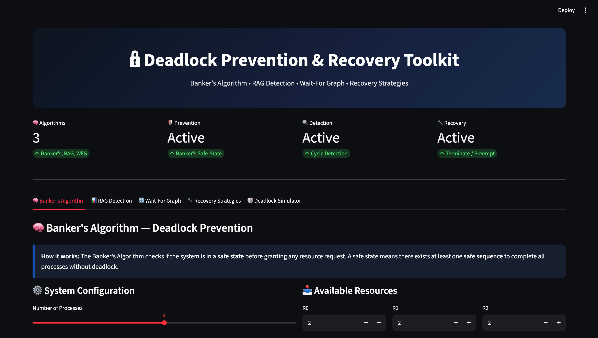

### ⚙️ Configuration Panel
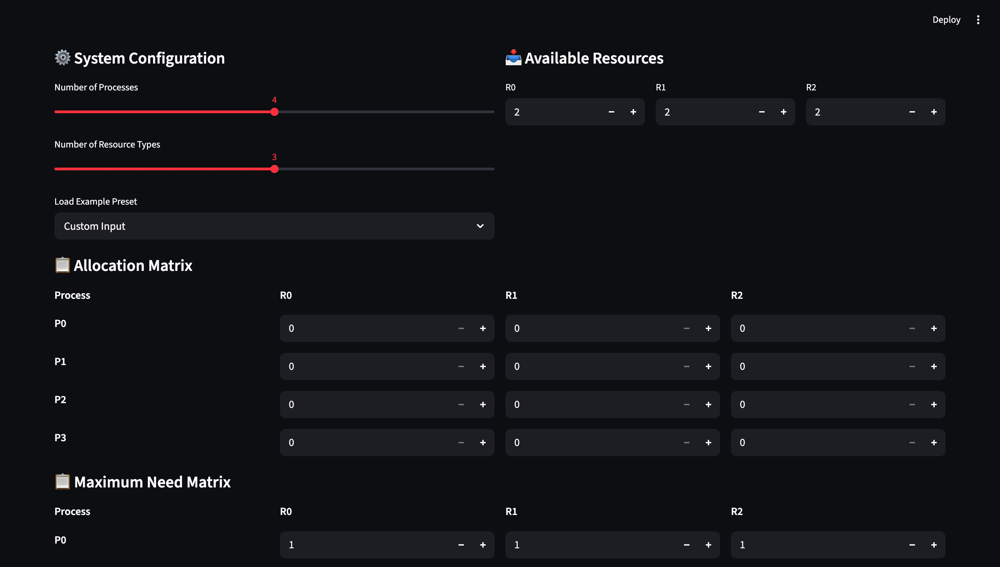

### 📊 Allocation Matrix
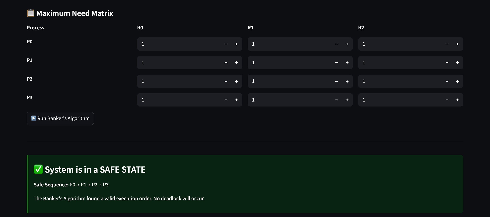

### 📈 Graph View
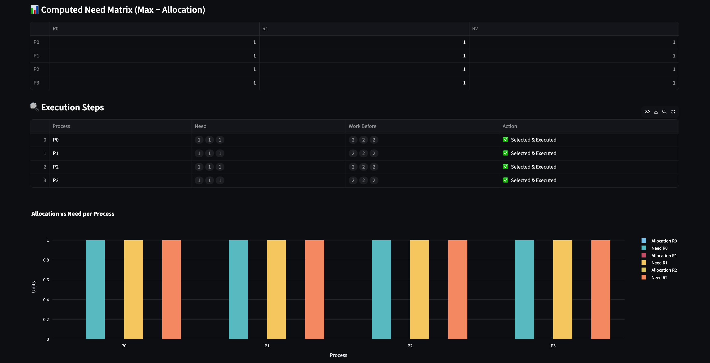

### 🔍 Detection Result
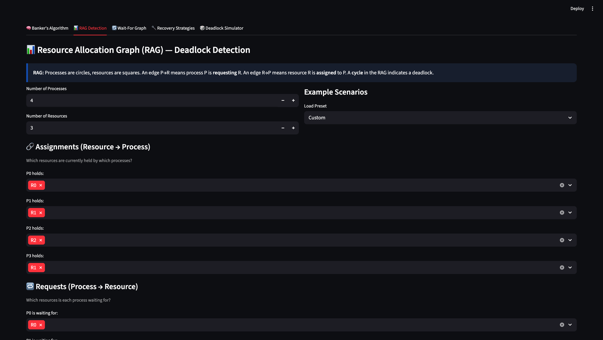

### 🔄 Recovery Output
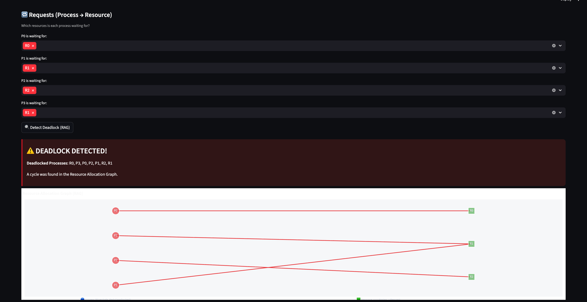

### 🧪 Simulation View
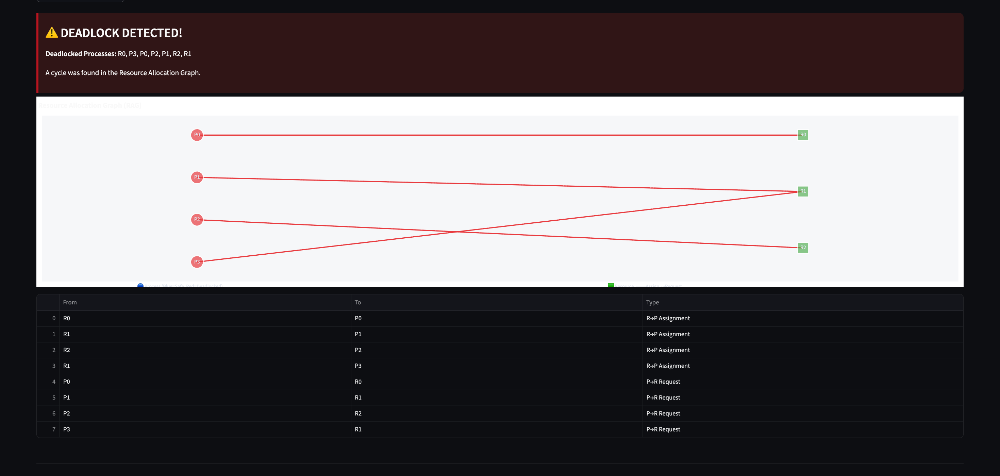

### 📌 Additional View 1
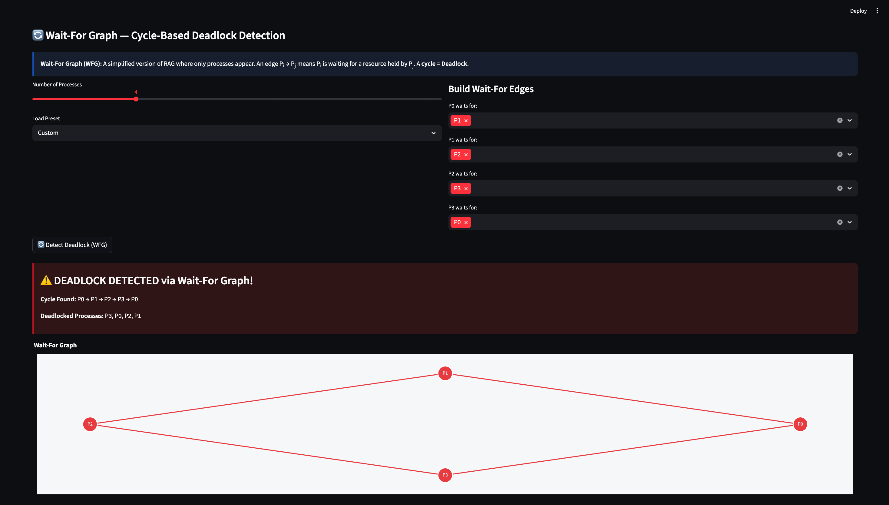

### 📌 Additional View 2
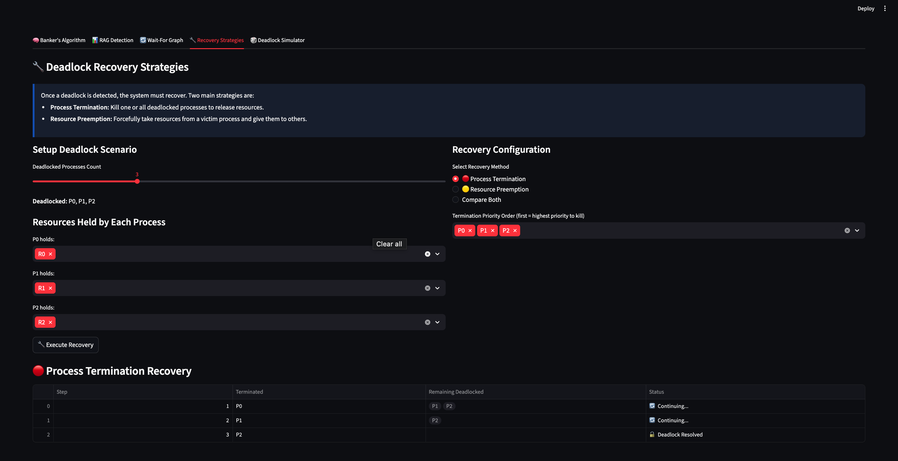

### 📌 Additional View 3
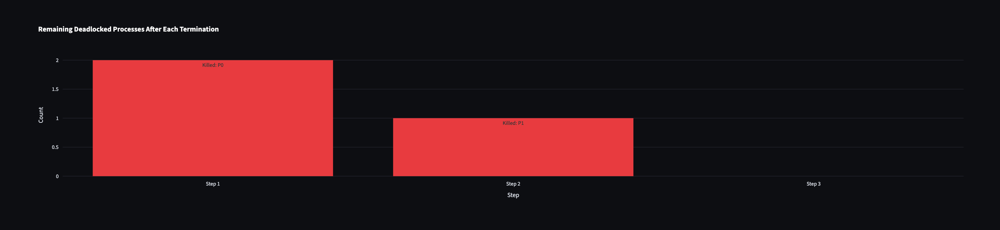

### 📌 Additional View 4
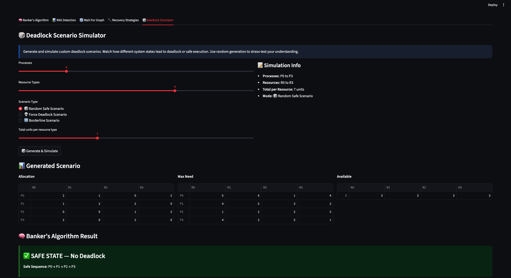

### 📌 Additional View 5
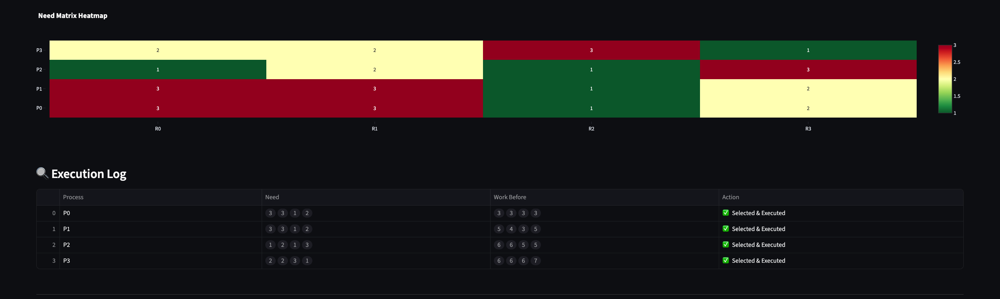

## 🌐 Future Enhancements

* Add more scheduling algorithms
* Improve UI/UX design
* Add animation for graph visualization
* Deploy with cloud integration

---

## 👨‍💻 Author

**Bhupesh Kumar**

---

## 📄 License

This project is for educational purposes.
